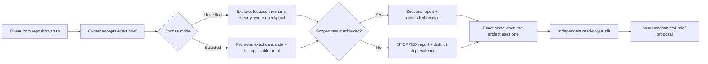

# Repo-First AI Workflow Kit

> **Historical reference.** This kit documents the pre-reset workflow (retired
> 2026-07-22). The current contract lives in the Cairn repository as
> `CONTRACT-TEMPLATE.md` (v0.5.0), copied deliberately into each project's
> `AGENTS.md`. This folder is kept for reference and is not law for any project.

A portable way to run AI-assisted software work without letting chat memory, ambiguous approval, or green-looking automation replace repository truth.

This directory is an **exportable reference**, not a second source of law for RunWithFriends. RunWithFriends is governed by root `CLAUDE.md`. A project adopting this kit must choose one project-specific canonical contract; these guides, templates, and prompts help implement that contract but never outrank it.

This kit separates three jobs:

1. **Explore** — discover the right direction, architecture, or integration contract and show the owner something useful early.
2. **Promote** — take one exact selected result through the complete applicable proof and make it the real/default result.
3. **Stop truthfully** — preserve what was learned, prove custody, and end without pretending the work completed.

## Start here

- Starting an empty or early-stage repository: [Project Kickoff](PROJECT-KICKOFF.md)
- Migrating an active repository: [Project Conversion](PROJECT-CONVERSION.md)
- Teaching the lifecycle visually: [Workflow Infographic](workflow-infographic.html)

The Markdown guides contain the complete copy/paste prompt library. The infographic is a standalone local HTML file; open it in any modern browser.

## Choose the lightest evidence level that solves the real risk

| Level | Use when | Include |
|---|---|---|
| **Core** | Small, low-risk, one-owner project | Canonical contract, accepted briefs, Explore/Promote, reports, independent review, truthful stops |
| **Verified** | Ongoing project with multiple agents or important releases | Core plus orientation, clean session bases, executable brief checks, generated receipts, distinct success/stop audits |
| **Forensic** | High-risk, dirty-tree, regulated, or provenance-sensitive work | Verified plus subject hashes, dirty-path custody, exact close commits, index/worktree audits, stop hooks |

Use Core for a small low-risk project. Verified is the sensible default for a long-lived project with repeated AI handoffs. Add Forensic machinery only to close a demonstrated provenance failure mode or meet a real assurance requirement.

RunWithFriends uses the Forensic level because it has deterministic simulation, governed goldens, long-lived dirty owner work, multiple AI sessions, and exact historical evidence. That does **not** make every Forensic mechanism universal.

For portable use, prefer a clean branch or worktree for each session. Dirty-overlay custody is recovery machinery, not the default way to organize a new project.

## The three roles

- **Owner** — accepts exact briefs and makes product, experience, risk, release, and other reserved decisions.
- **Coding agent** — implements one accepted brief and creates its report and any generated completion evidence.
- **Independent reviewer** — assumes neither success nor failure, reruns decisive read-only checks, and may propose the next brief. The reviewer never creates or repairs the evidence being reviewed.

## The five non-negotiables

1. **Repository truth before chat memory.** Every work session reads current instructions and state from disk.
2. **The owner accepts the exact brief.** The coding agent may implement it; it may not silently rewrite the target.
3. **Mode matches uncertainty.** Explore unsettled work; Promote only a selected candidate or settled system decision.
4. **Claims stay separated.** Automation proves checks; the owner approves user-visible experience; a stopped receipt proves only the stop.
5. **Independent review is read-only.** Reviewers audit existing evidence and draft the next brief; they do not create, replace, or “repair” receipts.

## Proof and command-safety boundaries

A receipt proves only that its declared commands ran against the subject it identifies. It does **not** prove the product is correct, a human approved the result, external services match, ignored files are harmless, secrets were absent, or another machine is equivalent.

Commands inside an accepted brief are executable code. Before accepting a brief, the owner should receive a plain-language command summary and an explicit warning for network access, credentials, deployment, destructive actions, billing, messaging, or other external writes. Verification commands should be local, bounded, noninteractive, idempotent, and free of secrets in their output. A command called an “audit” is not automatically harmless; inspect what it executes.

A `[manual]` line is a recorded obligation, not automated evidence. Required manual approval must name the reviewer, exact candidate, review route or evidence, date, and approval words. Silence is never approval.

## A brief has four kinds of contract

- **Hard invariants** — safety, security, determinism, data integrity, architectural law, and other rules that cannot weaken.
- **Owner-visible targets** — what the owner must run, see, hear, feel, or decide; automation cannot approve these.
- **Soft preservation preferences** — qualities worth retaining when practical but allowed to change inside authorized improvement.
- **Authorized refactoring** — the subsystem and boundaries the agent may restructure. Exact-output freezes require a named external contract or an already selected candidate.

## The recurring loop

## Vocabulary

- **Brief** — the exact accepted scope, mode, contracts, checks, stop conditions, and close path for one work block.
- **Report** — the plain-language outcome and evidence index written by the coding agent.
- **Receipt** — generated machine evidence for a stable subject. Never hand-write one.
- **Blocker key** — a stable name for the underlying cause of a stop. Two consecutive stops on the same cause prohibit another narrow repair.
- **Exact close** — an optional high-rigor Git transition that commits only a frozen report and generated receipt after verification.

## What this kit deliberately does not provide

- Product requirements, architecture, safety law, or testing commands for your project.
- Permission for an agent to decide user-visible experience on the owner's behalf.
- A reason to rewrite historical reports or manufacture receipts retroactively.
- A universal requirement to copy RunWithFriends' verifier, Git custody model, or session numbering.

Use the guides to make those choices against the target repository's actual risks.

Do not copy scripts blindly. `npm`, Node, `CLAUDE.md`, three-digit sessions, exact-close Git ancestry, and RunWithFriends' verifier schemas are examples from one repository, not portable law.
